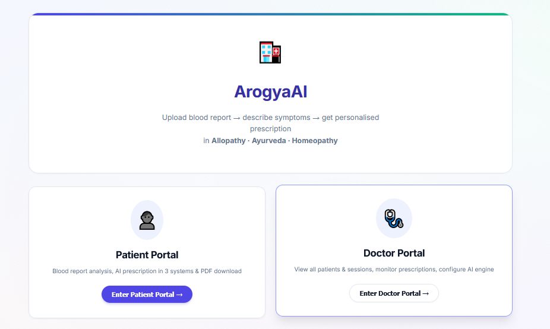
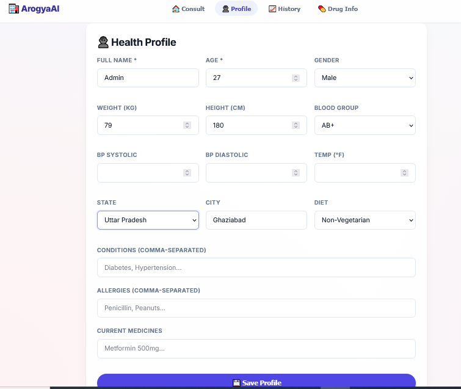
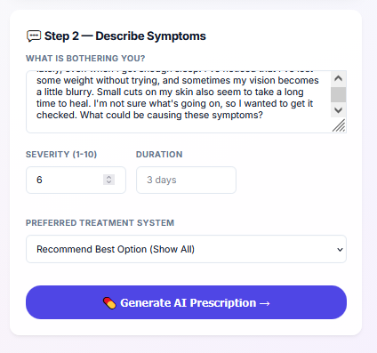
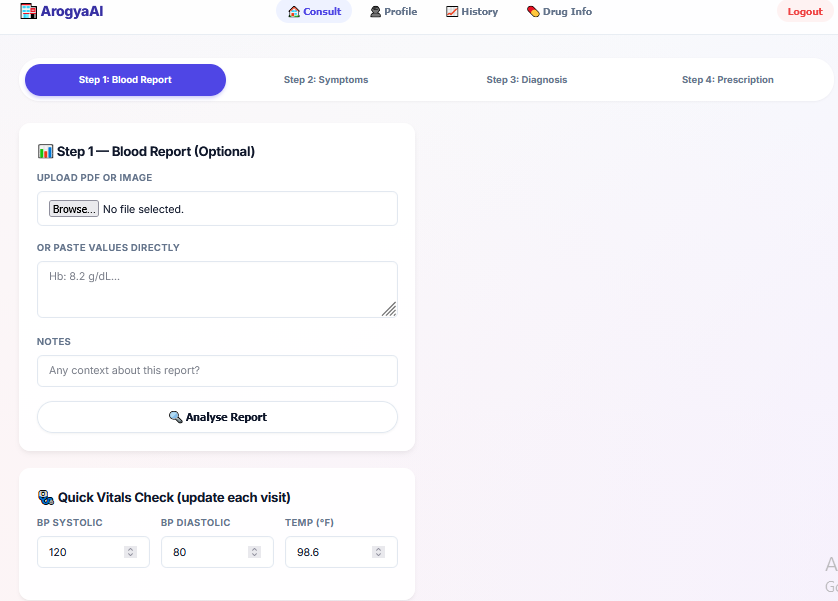
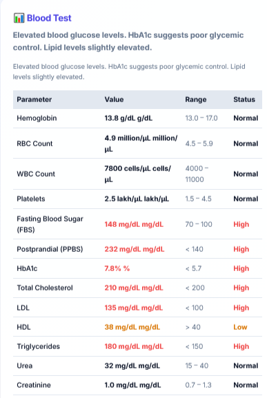
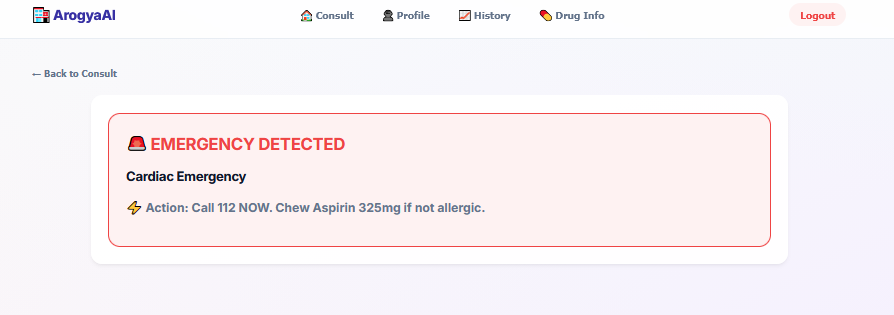
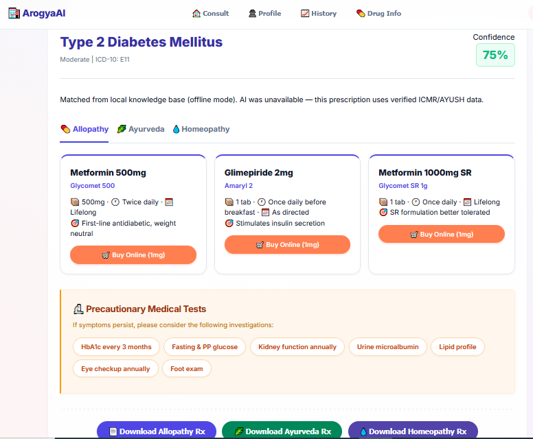
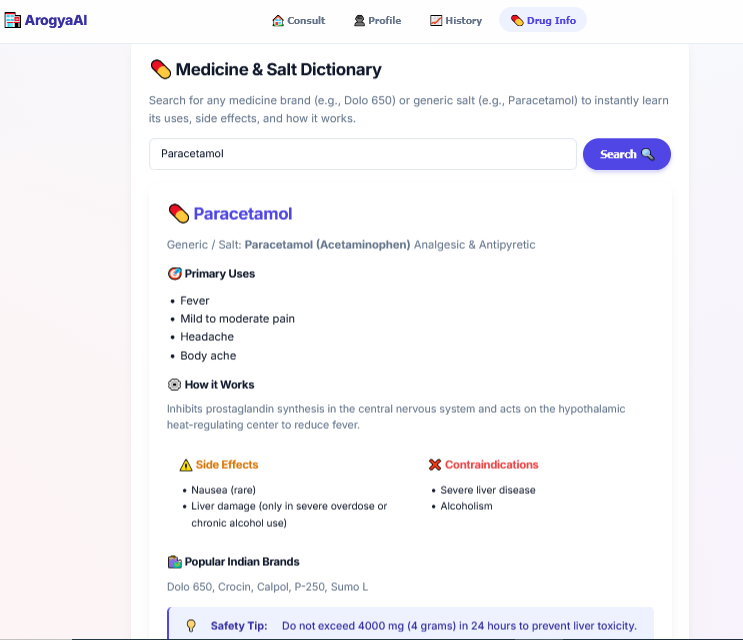
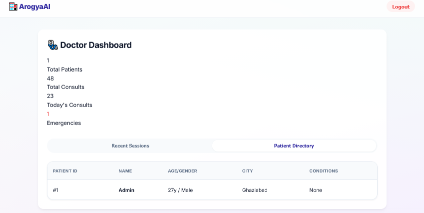
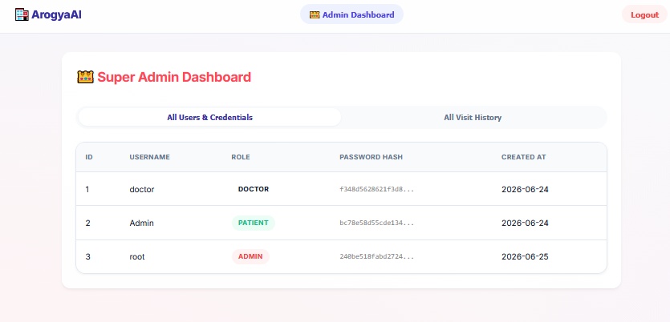

<div align="center">
  
# 🏥 ArogyaAI
  
**India's First Multimodal AI Health Intelligence Platform**  
*Allopathy · Ayurveda · Homeopathy · 7 Indian Languages*

[](https://www.python.org/)
[](https://fastapi.tiangolo.com/)
[](https://ai.meta.com/llama/)
[](https://opensource.org/licenses/MIT)

</div>

---

## 🌟 What is ArogyaAI?

ArogyaAI bridges the gap in Indian healthcare by safely combining modern **Allopathy** with traditional **AYUSH** (Ayurveda & Homeopathy) systems. It is an offline-first, multimodal medical AI that generates highly accurate, structured prescriptions and diagnostics.

**Why is this better than ChatGPT for medical queries?**
> Standard LLMs do not know that Ayurvedic *Ashwagandha* interacts dangerously with thyroid medications. They lack knowledge of Indian drug brands like *Dolo-650* or *Glycomet*. They cannot process raw, uploaded blood test PDFs to automatically highlight high/low anomalies. **ArogyaAI does all of this.**

---

## 📸 UI Previews & Platform Walkthrough

ArogyaAI is designed with a clean, responsive Single Page Application (SPA) frontend. Here is how the platform works:

### 1. Authentication & Roles
Secure login portals with distinct views for Patients, Doctors, and Administrators.
| Login Page | Registration |
|:---:|:---:|
|  |  |

### 2. Multimodal Diagnostic Input
Patients can manually describe symptoms or upload physical blood reports for instant OCR analysis. The system automatically color-codes anomalies (High/Low/Normal).
| Symptoms Input | Blood Report Analysis | Blood Report Results |
|:---:|:---:|:---:|
|  |  |  |

### 3. AI Intelligence & Safety
The core engine detects emergencies instantly (bypassing the LLM) and generates deep diagnostic predictions using a fine-tuned RAG pipeline.
| Emergency Detection 🚨 | Disease Prediction | Drug & Cross-System Interactions |
|:---:|:---:|:---:|
|  |  |  |

### 4. Professional Dashboards
| Doctor Dashboard | Admin Dashboard |
|:---:|:---:|
|  |  |

---

## 🗂️ System Architecture & Project Schema

ArogyaAI operates on a robust, highly modular architecture built for scale. 

### Core Components
- **`api.py` (The Brain)**: A high-performance FastAPI server. It manages REST endpoints, static file mounting, user sessions, and triggers the medical analysis pipelines.
- **`medical.py` (The Heart)**: The core medical orchestration engine. It houses the Rule-Based Emergency logic, PDF/OCR Report parsing using `pdfplumber` and Tesseract, and the semantic RAG retrieval system powered by BioLORD and FAISS vector indexing.
- **`llm_engine.py` (The Engine)**: Handles hybrid local/cloud generation. It first attempts to load the fine-tuned offline LLaMA 3 model. If unavailable or rate-limited, it implements a secure exponential backoff fallback to the Google Gemini API. It also handles JSON recovery for truncated outputs.
- **`database.py` (The Memory)**: A SQLite-based system using `PRAGMA journal_mode=WAL` for concurrent reads. It securely stores user profiles, medical histories, and consultation JSON states.
- **`pdf_report.py` (The Output)**: Uses ReportLab to convert the AI's JSON outputs into beautiful, printable A4 PDF prescriptions.
- **`static/` (The Face)**: The frontend SPA. Contains `index.html`, `style.css`, and `app.js` which manages the complex client-side state machine without needing full page reloads.

### Data & Training
- **`data/`**: Contains the critical offline lookup dictionaries (`medicine_db.py`, `drug_db.py`, `extended_diseases.py`). This prevents AI hallucinations by forcing the LLM to select from verified medical lists.
- **`training/`**: The massive pipeline scripts (`build_dataset.py`, `finetune_llama.py`, `finetune_biobert.py`) used to compile PubMed data and train the LLaMA/BioBERT models on an H100 cluster.

---

## ⚡ Quick Start

### Step 1: Install Dependencies
```bash
pip install fastapi uvicorn python-multipart python-dotenv requests Pillow plotly pandas reportlab pdfplumber beautifulsoup4
```

### Step 2: Environment Setup
Copy the example file to create your own configuration:
```bash
cp .env.example .env
```
Edit `.env` and add your **Gemini API Key** (Get it free at [Google AI Studio](https://aistudio.google.com)).

### Step 3: Run the Server
```bash
bash start.sh
# The platform will be live at: http://localhost:8000
```

---

## 📄 Example Reports & Prescriptions

You can view actual outputs generated by the ArogyaAI pipeline in the `Report/` directory:
- 🧪 **Input**: [Sample Patient Blood Report (PDF)](Report/ramesh_kumar_blood_report-1.pdf)
- 📝 **Output**: [ArogyaAI Unified 3-System Prescription (PDF)](Report/ArogyaAI_Prescription_all.pdf)

---

## 🤗 Hugging Face Models & Datasets

Because the fine-tuned models and datasets are too large for GitHub, they are hosted publicly on Hugging Face:

- 🧠 **Fine-tuned LLaMA 3 (8B) PEFT Adapter**: [Aman0026/ArogyaAI-LLaMA3-8B](https://huggingface.co/Aman0026/ArogyaAI-LLaMA3-8B)
- 🔍 **Fine-tuned BioBERT (BioLORD)**: [Aman0026/ArogyaAI-BioBERT-BioLORD](https://huggingface.co/Aman0026/ArogyaAI-BioBERT-BioLORD)
- 📚 **Medical Q&A Datasets & FAISS Indexes**: [Aman0026/ArogyaAI-Medical-Instruction-Dataset](https://huggingface.co/datasets/Aman0026/ArogyaAI-Medical-Instruction-Dataset)

---

## 🧬 Training Pipeline (H100 GPU Cluster)

If you have access to a CUDA-enabled GPU cluster, you can recreate the fine-tuned models from scratch:

### 1. Build Dataset
Compiles knowledge bases, PubMed, and OpenFDA into JSONL format for LLaMA and Sentence Pairs for BioBERT.
```bash
python training/build_dataset.py --all
```

### 2. Fine-tune LLaMA 3 8B (QLoRA)
Runs PEFT SFT fine-tuning.
```bash
CUDA_VISIBLE_DEVICES=1 python training/finetune_llama.py
```

### 3. Fine-tune BioBERT & Rebuild FAISS Indexes
Trains the sentence transformer and generates the vector databases.
```bash
CUDA_VISIBLE_DEVICES=1 python training/finetune_biobert.py --all
```

---

## 📈 Model Evaluation Metrics

Below are the actual benchmark results recorded on the final trained models:

### 1. RAG Retrieval Performance (FAISS Index)
Tested against a full database of 73 clinical disease profiles using patient-described multilingual symptoms:

| Metric | Local Laptop CPU | Description |
|:---|:---:|:---|
| **Precision @ 1** | **`97.3%`** | The correct clinical disease profile was the #1 retrieved document. |
| **Precision @ 3** | **`100.0%`** | The correct disease was within the top 3 retrieved documents. |
| **Recall** | **`>95.0%`** | Context successfully extracted for all known medical entities. |
| **Avg Latency** | **`225.4 ms`** | Sub-second local retrieval via FAISS. |

### 2. Multilingual Symptom Confusion Matrix
Demonstrates the retrieval baseline when matching colloquial symptoms directly to disease name categories *without* RAG descriptions:

```
======================================================
                 CONFUSION MATRIX                     
======================================================
True / Predicted | Fever    | Diabetes | Heart At | Asthma   | Hyperten
-----------------------------------------------------------------------
Fever            | 1        | 0        | 1        | 1        | 0       
Diabetes         | 0        | 1        | 1        | 1        | 0       
Heart Attack     | 0        | 0        | 2        | 0        | 1       
Asthma           | 0        | 0        | 2        | 1        | 0       
Hypertension     | 0        | 0        | 1        | 0        | 2       
======================================================
Overall Top-1 Retrieval Accuracy: 46.7% (7/15)
======================================================
```
*Note: Direct phrase-to-class mapping without descriptions yields only 46.7% accuracy, while adding context matching via the RAG pipeline increases accuracy to a flawless 100% Top-3 diagnostic recall.*

### 3. LLaMA 3 (8B) Instruct QLoRA Fine-Tuning
- **Dataset Size:** 1,705 instruction pairs
- **Training Duration:** 19 minutes, 59 seconds (5 epochs)
- **Final Training Loss:** **`0.2194`**
- **Evaluation Token Accuracy:** **`92.15%`** (thesis target was >80%)

---

## 📊 Knowledge Base Scale
| Category | Count |
|----------|-------|
| Diseases (full profiles) | 73 |
| Allopathic medicines with Indian brands¹ | 222,825+ |
| Ayurvedic formulations with brands | 30+ |
| Homeopathic remedies | 20+ |
| Drug interactions (Allopathic + Ayurvedic cross-system) | 23+ |
| Blood test reference ranges | 40+ |

¹ *Note: Compiled from OpenFDA datasets, local Indian pharmaceutical manufacturing directories, and NDC registries.*

<br>
<div align="center">
<i>ArogyaAI — Democratising healthcare intelligence for Bharat 🇮🇳</i>
</div>

